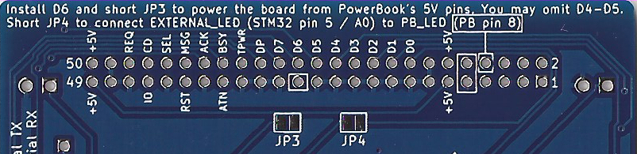

# **blueSCSI (evolved) by MrGasS aka S.E.M.M.**  
  
  
  
blueSCSI (evolved) is a PCB based on the original Eric Helgeson's BlueSCSI schematics and board, this PCB aims to be a 3-in-1 (Internal 50 pin, external DB-25 and internal PowerBook) BlueSCSI device.  
  
I made this PCB for personal use, but I like to share it :)  
  
This PCB gives you a typical 50 pin port for internal computer/case use, a DB-25 port for external use and a 40 pin PowerBook port.  
  
I'm not absolutely responsible if your STM32, your Macintosh or your cat explodes.  
This design was tested intesively under a vast variety of Macs, but use it at your own risk.  
So, if you should damage something "sono cazzi tuoi" as we say here in Italy.  
  
__________________________________________________________________________________________________________  
## **BOM:**  
  
BluePill_STM32F103C: an STM32 BluePill board (installing a 40 pin socket is recommended);  
R1 (for POWER led): 330 ohm resistor OR short if resistor is soldered on LED;  
R2 (for ACT led): 330 ohm resistor OR short if resistor is soldered on LED;  
J3: POWER/+5v led;  
J4: ACT led;  
D4: 1N5818 diode, from BERG 5V to STM32 VCC;   
D5: 1N5818 diode, from SCSI TERMPWR/TPWR to STM32 VCC;   
D6: 1N5818 diode,  from PowerBook 5V to STM32 VCC;   
RN2 - RN4: 18x 330 ohm resistors | OR | 2x 4610X-101-331LF;  
RN1 - RN3: 18x 220 ohm resistors | OR | 2x 4610X-101-221LF;  
SCSI 50 pin: 2x25 = 50 pin header (or 25 pins in the 2-49 pins row, since it has five GND points and the other row is all GNDs);  
SCSI DB-25: female DB-25 90° degrees (or right angle, I don't know how to call it) port;  
SCSI PowerBook: 2.0mm 50 pin (or 40 pin from the power led to the rectangle) 90° degrees (or right angle, I don't know how to call it) header;  
__________________________________________________________________________________________________________  
## **JUMPERS and other ports:**  
  
TERM_GND and TERM_5V: short them with a jumper to enable termination.  
  
BERG: compatible BERG/floppy molex header.  
__________________________________________________________________________________________________________  
## **Image Set selector - How to use it**  
  
As described in Eric Helgeson's BlueSCSI documentation (https://github.com/erichelgeson/BlueSCSI/wiki/Image-Sets) you can use these jumpers to select a set of images at your choice. 
   
FOLDER NAMES / jumpers position:  
ImageSetAll: persistent images folder, they'll be loaded without caring about jumpers position;  
ImageSet0 or root / ALL OFF;  
ImageSet1 / A ON;  
ImageSet2 / B ON;  
ImageSet3 / ALL ON.  
__________________________________________________________________________________________________________  
## **Using RaSCSI and BlueSCSI together**  
  
If you have an internal BlueSCSI with termination enabled into your Macintosh and a RaSCSI board externally attached to it, please, remove termination from the external RaSCSI board, or you could face weird behaviors from your Mac while loading the OS.  
Even if you'll face weird problems with an internal SCSI2SD or a typical hard disk drive, please, try to remove termination from the BlueSCSI or the RaSCSI.  
__________________________________________________________________________________________________________  
## **How to make a resistor net?**  
  
Well, as you can see from this sample image, assembling a resistor net with your hands is very simple.  
In order to make ONE resistor net just solder 9 resistors like the image, then short the other end of every resistor and solder everything to the square point.  
It's simple, really.  

  
__________________________________________________________________________________________________________  
## **How to install an SD card slot?**  
  
blueSCSI (evolved)  offers you three way to install an SD Card reader on your board:  
1 - SMD MicroSD Card Slot: the best option if you have SMD soldering skills, the part should be easily sourced from eB4y and 4li3xpress, you can recognize it from the two plastic dots under it;  
2 - MicroSD -> SD Adapter: the best option if you DON'T have SMD soldering skills, just solder an header like the photo and solder everything on the board;  
3 - Pin header: the best option if you want to keep an adapter/reader out your Mac with wires, extremely useful if you want to exchange the SD card without disassembling your Macintosh computer.  
  
  
__________________________________________________________________________________________________________  
## **Can I daisy-chain my blueSCSI (evolved) board?**  
    
Yes, indeed you can, just find yourself a way to do it, like the example below.  
  
blueSCSI (evolved) with a daisy-chain adapter (cute RaSCSI Reloaded THT PCB board) going to a Macintosh Quadra 700 and a SCSI2SD attached to the blueSCSI's DB-25 port:  
  
  
__________________________________________________________________________________________________________  
## **PowerBook use - A little guide**  
  
blueSCSI (evolved) gives you the ability to install it into your PowerBook laptop.  
  
Install a 2.0mm pin header, maybe a 90° degree one, accordingly to your PowerBook SCSI connector (40 pin or 50).  
  
After you installed it, cut the "boxed" pins like this 40 pin install example:  

  
  
As you can see from the back of the board, you can install a diode in D6 and then short JP3 to power the entire board from PowerBook's 5V pins.  
During tests this worked, but wasn't mandatory as the board also powered itself from TERMPWR/TPWR pin on PowerBook connector: if this way works for you (D5 must be present) omit shorting JP3 and soldering D6.  
  
LED feature was inspired from the original RaSCSI Reloaded 2.4 board but I didn't tested this yet, use this feature at your own risk.  
To connect EXTERNAL_LED (STM32 pin 5 / A0) to PB_LED (PB pin 8) just short JP4.    
  
  
__________________________________________________________________________________________________________  
## **Some pictures of the current released PCB**  
  
blueSCSI (evolved) v1.0 - fully assembled and working:  
  
  
blueSCSI (evolved) v1.0 - front view:  
  
  
blueSCSI (evolved) v1.0 - back view:  
  
  
*Latest README.md update: 7oct2022*  
